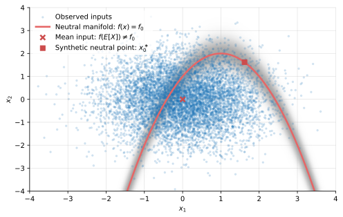

# CBaseline

[](https://pypi.org/project/cbaseline/)

CBaseline constructs **prediction-neutral background distributions** for feature attribution methods such as SHAP, Integrated Gradients, TreeIG, and EDEF.

Given a fitted model, a reference dataset, and a user-specified reference prediction $f_0$, CBaseline constructs an empirical background distribution of features whose average model output equals $f_0$. Feature attributions computed relative to this background therefore explain

$$f(x) - f_0,$$

the prediction difference the explanation is intended to describe.

Unlike methods that generate synthetic reference points, CBaseline uses only observed data. It does not modify the attribution algorithm, approximate Shapley values, or introduce a generative model of the feature distribution. Its only role is to construct the background distribution that best matches the attribution question, which is then supplied to the attribution method.

The canonical choice for $f_0$ is the unconditional prediction from the model. All other choices use additional information. However, other choices for $f_0$ may be of interest in certain situations. 

CBaseline provides two complementary constructions.

- **Weighted backgrounds** preserve all localized observations together with observation weights. They satisfy the neutrality constraint to machine precision and are preferred whenever the attribution method natively supports observation weights.

- **Equal-weight backgrounds** select a compact deterministic subset of observed cases with equal weights. They are designed for software, including standard SHAP implementations, that accepts only an unweighted background matrix.

Both constructions are deterministic conditional on the fitted model and reference sample.

Hentschel (2026a) and Hentschel (2026b) develop the methodology for CBaseline.

---

## Installation

```bash
pip install cbaseline
```

CBaseline requires

- Python 3.9 or newer
- NumPy
- SciPy

---

## Quickstart

The most common use case is supplying an equal-weight background to SHAP.

```python
import shap

from cbaseline import background

# model outputs on the reference sample
f_train = model.predict(X_train)

# reference prediction
f0 = float(f_train.mean())

# construct a deterministic equal-weight background
bg = background(
    predictions=f_train,
    f0=f0,
    features=X_train,
    weighting="equal",
    size=100,
)

X_background = bg.rows

explainer = shap.Explainer(model.predict, X_background)
phi = explainer(X_eval)
```

`X_background` is simply a NumPy array containing 100 observed rows. It can be supplied anywhere an unweighted SHAP background is expected.

The diagnostics report how closely the selected background satisfies the requested neutrality constraint.

```python
print(bg.diagnostics["selected_neutrality_norm"])
print(bg.predictions.mean(), f0)
```

Because SHAP's base value equals the mean prediction over the supplied background, the resulting feature attributions satisfy

$$ \sum_j \phi_j(x) = f(x) - f_0.$$

No changes to SHAP itself are required.

## Why prediction-neutral backgrounds?

Every feature attribution answers a counterfactual question. For Shapley
methods that question is determined entirely by the background distribution.

Using a background distribution $Q$, the attribution explains

$$ f(x) - \mathbb{E}_Q [f(X)]. $$

Changing the background therefore changes the prediction difference being
decomposed, even though the attribution algorithm itself is unchanged.

CBaseline constructs a background whose mean prediction equals a user-specified
reference level $f_0$. The resulting attribution therefore explains

$$ f(x) - f_0, $$

which is usually the prediction difference of scientific or practical interest.

Unlike methods that generate synthetic reference points, CBaseline uses only
observed inputs. The background remains supported by the empirical data while
being localized around the desired prediction level.

<p align="center">
  
</p>

The figure illustrates the idea. The red curve is the prediction-neutral
manifold

$$ \mathcal{M}_0 = \{x : f(x) = f_0\}. $$

CBaseline constructs its background from observed cases lying near this
manifold. The background is therefore simultaneously

- neutral in prediction,
- supported by observed data, and
- concentrated on the comparison of interest.

Regions of the manifold that contain little or no observed data naturally
receive little weight.

Localization is performed entirely in prediction space rather than feature space. Observations are considered close when their model outputs are similar, regardless of how far apart they may lie in the original feature space. Consequently, the construction scales naturally to very high-dimensional inputs without suffering from the curse of dimensionality associated with kernel methods in feature space.

---

## Choosing the reference prediction

CBaseline requires the reference prediction `f0` explicitly. The attribution answer the question "Why does the model predict $f(x)$ instead of $f_0$.  Different choices answer different questions, so the package deliberately does not choose $f_0$ for you.

### Regression

The canonical choice is the unconditional mean prediction. We often proxy this with the unconditional training mean,

```python
f_train = model.predict(X_train)
f0 = float(f_train.mean())
```

The resulting attribution explains why the prediction differs from the model's
typical prediction. This is the canonical choice because it is an uninformed but sensible prediction. All other baselines incorporate additional information. 

### Binary classification

We attribute the model score (or logit), not the probability, because that is the model's direct output and because the scores are additive, whereas probabilities are not. 

For the canonical comparison, we can use the mean score,

```python
scores = model.decision_function(X_train)
f0 = float(scores.mean())
```

For decision-oriented explanations, use the decision threshold itself. For a
logistic classifier this is often

```python
f0 = 0.0
```

which asks why the observation lies on one side of the decision boundary rather
than the other.

It is often easier to think about probabilities rather than logit scores but there is a one-to-one mapping between the two. 

### Multiclass classification

CBaseline is designed to work with **centered logits**, not probabilities.

Let

```python
logits = model.decision_function(X_train)
Z = logits - logits.mean(axis=1, keepdims=True)
```

and compute the mean class probabilities

```python
p_star = model.predict_proba(X_train).mean(axis=0)
```

The corresponding neutral centered-logit vector is

```python
z_star = np.log(p_star)
z_star -= z_star.mean()
```

Then construct the background with

```python
bg = background(
    predictions=Z,
    f0=z_star,
    features=X_train,
    weighting="equal",
    size=200,
)
```

CBaseline automatically detects and removes the redundant common-logit direction, so a $K$-class problem is treated as a $K - 1$ dimensional neutrality problem.

### Scalar versus vector neutrality

The recommended approach is to construct **one background that is neutral for
all classes simultaneously** by passing the full centered-logit matrix.

This produces a single reference population that can be reused for explaining
every class and every observation.

If you are interested only in a single class, you may instead construct a
scalar background using one centered-logit column,

```python
c = predicted_class

bg = background(
    predictions=Z[:, c],
    f0=float(z_star[c]),
    features=X_train,
    weighting="equal",
    size=100,
)
```

This is an easier balancing problem and usually achieves a smaller neutrality
residual, but the resulting background is specific to class `c`; a different
target class requires a different background.

---

## Equal-weight and weighted backgrounds

CBaseline provides two closely related background constructions.

### Equal-weight background

```python
from cbaseline import background

bg = background(
    predictions=f_train,
    f0=f0,
    features=X_train,
    weighting="equal",
    size=100,
)
```

This returns exactly 100 observed rows with equal weight. They are the observations closest to the prediction manifold $\mathcal{M}_0$

The construction is deterministic: repeating the calculation with the same
reference sample, fitted model, and reference prediction always returns exactly
the same background. Consequently the background itself introduces no Monte
Carlo variability into the attribution.

Because finite samples may not contain an exactly neutral equal-weight subset,
the achieved neutrality residual is reported in the diagnostics.

This is the recommended background for standard SHAP implementations and any
other attribution software that accepts only an unweighted background matrix.

---

### Weighted background

```python
from cbaseline import background

wb = background(
    predictions=f_train,
    f0=f0,
    features=X_train,
    weighting="calibrated",
)

X_bg, w = wb.rows, wb.weights
```

The weighted construction retains a localized neighborhood of observed cases and
assigns observation weights.

The initial kernel weights localize the empirical distribution around the
reference prediction. An exponential calibration then adjusts those weights so
that the weighted mean prediction equals $f_0$ to machine precision whenever
the requested reference lies within the localized support.

Both the kernel weights and the calibrated weights are retained:

```python
wb.result.kernel_weights
wb.result.calibrated_weights
```

Whenever the downstream attribution method accepts observation weights, this is
the preferred construction because it achieves exact finite-sample neutrality
without introducing Monte Carlo error.

If the downstream attribution method does not accept observation weights, use
the equal-weight construction (`weighting="equal"`) instead. This returns a compact deterministic background designed specifically for weight-blind attribution software.

The weighted result also provides a `resampled()` method:

```python
X_bg = wb.resampled(500, random_state=0)
```

This is a lower-level compatibility option for applications that specifically
need an unweighted Monte Carlo approximation to the calibrated weighted
distribution. It reproduces that distribution only in expectation, introduces
sampling variability, and may require many rows. It is therefore generally
inferior to `weighting="equal"` for standard SHAP use.

Diagnostics include both kernel and calibrated effective sample sizes.

## Bandwidth and background size

The two constructions expose different tuning parameters because they solve
different optimization problems.

### Equal-weight background

For `weighting="equal"`, the primary tuning parameter is simply

```python
size=100
```

which fixes the number of background observations and therefore the downstream
attribution cost.

Larger values generally produce smaller neutrality residuals because the
selection has more flexibility while remaining equally weighted.

### Weighted background

For `weighting="kernel"` or `weighting="calibrated"`, the tuning parameter is the localization bandwidth.

By default CBaseline uses a shrinking Silverman-type rule,

```python
wb = background(
    predictions=f_train,
    f0=f0,
    features=X_train,
    weighting="calibrated",
)
```

The bandwidth may also be specified directly,

```python
wb = background(
    predictions=f_train,
    f0=f0,
    features=X_train,
    weighting="calibrated",
    bandwidth=0.25,
)
```

or initialized from a fixed quantile,

```python
wb = background(
    predictions=f_train,
    f0=f0,
    features=X_train,
    weighting="calibrated",
    quantile=0.10,
)
```

The fixed-quantile option is convenient in finite samples but does not satisfy
the standard shrinking-bandwidth conditions used in nonparametric estimation.

---

## Diagnostics

Both constructions report what was actually achieved rather than assuming
successful localization.

For the equal-weight background,

```python
d = bg.diagnostics

d["selected_neutrality_norm"]
d["selected_mean_prediction"]
d["selected_raw_gap"]
d["slide_shift"]
d["n_selected"]
d["tolerance_met"]
```

For the weighted background,

```python
d = wb.diagnostics

d["calibrated_neutrality_norm"]
d["kernel_ess"]
d["calibrated_ess"]
d["calibration_success"]
d["calibration_degenerate"]
d["widening_steps"]
```

The diagnostics are intended both for quality control and for understanding why
a particular localization succeeded or failed.

When the requested reference prediction lies near the edge of the observed
support, exponential calibration may satisfy the neutrality constraint only by
placing almost all weight on a handful of observations. CBaseline detects this
automatically and reports it through `calibration_degenerate`.

---

## Performance

Localization requires a single linear scan through the reference sample.
Subsequent calculations operate only on a bounded candidate pool, so the running
time grows approximately linearly in the number of reference observations.

The fitted prediction metric may be reused whenever multiple backgrounds are
constructed from the same reference sample:

```python
from cbaseline import fit_prediction_metric

metric = fit_prediction_metric(predictions)

for size in (50, 100, 200, 400):
    bg = background(
        predictions,
        f0,
        X_train,
        weighting="equal",
        size=size,
        metric=metric,
    )
```

This avoids repeatedly estimating the prediction-space metric and is
particularly useful when studying the effect of different background sizes or
reference predictions.

## What CBaseline changes

CBaseline changes only the **background distribution** supplied to the
attribution method.

It does **not**

- modify the Shapley algorithm;
- approximate Shapley values;
- change the attribution axioms;
- fit a generative model of the feature distribution; or
- alter the underlying predictive model.

For Shapley methods, the background determines the reference prediction being
explained. CBaseline therefore changes the *question* being answered rather than
the attribution algorithm itself.

For interventional SHAP, the background fixes the empty-coalition value

$$ v(\emptyset) = \mathbb{E}_Q [f(X)]. $$

Choosing a prediction-neutral background sets this quantity equal to the desired
reference prediction,

$$ v(\emptyset) = f_0. $$

The remaining coalition values are still computed by the attribution method in
the usual way. Consequently, CBaseline changes the interpretation of the
attribution without changing its mathematical definition.

---

## Comparison with common background choices

| Background | Neutral in output | Observed inputs | Deterministic | Synthetic model |
|:-----------|:-----------------:|:---------------:|:-------------:|:---------------:|
| Mean input | ✗ | ✗ | ✓ | ✗ |
| Random subsample | Approximately | ✓ | ✗ | ✗ |
| Full reference sample | ✓ | ✓ | ✓ | ✗ |
| Generated counterfactuals | ✓ | ✗ | ✗ | ✓ |
| **CBaseline** | ✓ | ✓ | ✓ | ✗ |

The distinguishing feature of CBaseline is that it combines three properties:

- prediction neutrality,
- observed-data support, and
- deterministic construction.

Many existing approaches satisfy one or two of these properties, but not all
three simultaneously.

The full reference sample is prediction-neutral by construction but is not
localized around the comparison of interest. Random subsamples inherit that
reference only in expectation and introduce additional sampling variability.
Methods based on generated counterfactuals require fitting a model for the
feature distribution, whereas CBaseline samples directly from the observed data.

## Related software

CBaseline is complementary to existing attribution methods.

- **SHAP** attributes predictions relative to a background distribution.
- **Integrated Gradients** attributes predictions relative to a baseline point or distribution.
- **TreeIG** computes exact Integrated Gradients for tree models.
- **EDEF** provides an attribution of model fit instead of predictions.

CBaseline supplies the reference distribution itself. It can therefore be used with any attribution method whose interpretation depends on a background or reference population.

This prediction-neutral principle underlies the canonical Integrated Gradients baseline developed in Hentschel (2026). CBaseline extends that idea from a weighted background distribution to equally-weighted background distributions suitable for SHAP attribution.

---

## API

The primary public entry point is `background`:

```python
from cbaseline import background

bg = background(
    predictions,
    f0,
    features,
    weighting="equal",       # "equal", "kernel", or "calibrated"
    size=100,                # required only for equal weights
)

bg.rows                      # observed background rows
bg.weights                   # weights aligned with rows
bg.index                     # indices in the reference sample
bg.predictions               # model outputs for the rows
bg.diagnostics
```

For a calibrated weighted background:

```python
wb = background(
    predictions,
    f0,
    features,
    weighting="calibrated",
)

X_bg, w = wb.rows, wb.weights
```

For direct, uncalibrated kernel weights, use `weighting="kernel"`.

The descriptive constructors `uniform_background` and
`kernel_weighted_background` remain available for backward compatibility and
for users who need their method-specific result objects directly.

Supported kernels are `"gaussian"`, `"epanechnikov"`, and `"uniform"`.

---

## Project status

CBaseline currently supports

- regression;
- binary classification;
- multiclass classification using centered logits;
- equal-weight and weighted empirical backgrounds; and
- reference samples ranging from thousands to millions of observations.

Future extensions may include

- adaptive and varying-bandwidth localization;
- decision-boundary and pairwise-class backgrounds;
- native weighted-background support in downstream attribution libraries; and
- additional convenience wrappers for common machine-learning frameworks.

---

## Citation

If CBaseline contributes to published work, please cite

```bibtex
@misc{hentschel2026cbaseline,
  author = {Hentschel, Ludger},
  title  = {A Canonical Background Distribution for Shapley Attribution},
  year   = {2026},
  url    = {https://www.ludgerhentschel.com/Research.html},
}
```

---

## References

- Deville, Jean-Claude, and Carl-Erik Särndal, 1992, "Calibration estimators in survey sampling." *Journal of the American Statistical Association.*
- Hentschel, Ludger, 2026a, "Canonical Integrated Gradients: Expectations over Neutral Prediction Baselines."
- Hentschel, Ludger, 2026b, "A canonical background distribution for Shapley attribution."
- Izzo, Cosimo, Aldo Lipani, Ramin Okhrati, and Francesca Medda, 2021, "A baseline for Shapley values in MLPs: From missingness to neutrality." *Proceedings of the 29th European Symposium on Artificial Neural Networks, Computational Intelligence and Machine Learning (ESANN).*
- Lundberg, Scott M., and Su-In Lee, 2017, "A unified Approach to Interpreting Model Predictions." *Proceedings of the 31st International Conference on Neural Information Processing Systems.*
- Merrick, Luke, and Ankur Taly, 2020, "The explanation game: Explaining machine learning models using Shapley values." in *Machine Learning and Knowledge Extraction* (Holzinger, Andreas, Peter Kieseberg, A Min Tjoa, and Edgar Weippl, eds.)
- Sundararajan, Mukund, Ankur Taly, and Qiqi Yan, 2017, "Axiomatic Attribution for Deep Networks." *Proceedings of the 34th International Conference on Machine Learning.*

---

## License

CBaseline is distributed under the terms of the MIT License. See
[LICENSE](LICENSE) for details.