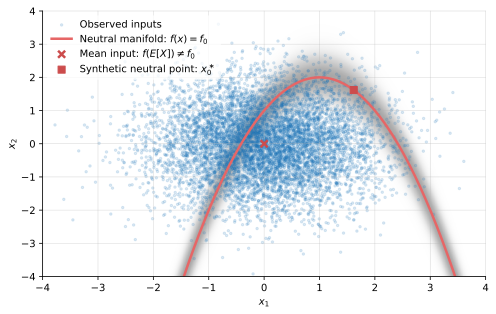

# CBaseline documentation

CBaseline constructs prediction-neutral empirical backgrounds for Integrated
Gradients and SHAP. Start with the prediction contrast you want to explain,
then construct a reference distribution from observed inputs.



The blue points are observed inputs; the red curve is the neutral manifold,
$\mathcal{M}_0=\{x:f(x)=f_0\}$. CBaseline builds its background from observed
cases near this curve in prediction space, illustrated by the shaded band.
The background therefore represents realistic reference inputs concentrated
around the prediction being used for comparison.

Calibrated weighted backgrounds fit naturally into the **UnifiedIG / TreeIG
stack**. Deterministic equal-weight backgrounds give **SHAP** a first-class
workflow through its standard background-matrix interfaces.

## The supporting papers

- Hentschel (2026a), [**Canonical Integrated Gradients: Expectations over Neutral Prediction Baselines**](https://www.ludgerhentschel.com/PDFs/Hentschel%20'26h.pdf): the reference-distribution formulation and calibrated estimation.
- Hentschel (2026b), [**A Canonical Background Distribution for Shapley Attribution**](https://www.ludgerhentschel.com/PDFs/Hentschel%20'26i.pdf): the Shapley formulation and equal-weight construction.

The guide develops the practical ideas alongside the papers; see
[papers and citation](references.md) for BibTeX and further reading.

## Begin with the comparison

With a background distribution $Q$, complete attributions explain
$f(x)-\mathbb{E}_Q[f(X)]$. CBaseline localizes the reference sample near
$f_0$ and matches that mean exactly to numerical tolerance with calibrated
weights, or approximately with a fixed-size equal-weight set.

Use [getting started](getting-started.md) for a runnable construction,
[integrations](integrations.md) for attribution examples, and
[choosing the reference prediction](reference-predictions.md) before adapting
an example to classification.

```{toctree}
:maxdepth: 2
:caption: User guide

getting-started
concepts
reference-predictions
backgrounds
integrations
diagnostics
```

```{toctree}
:maxdepth: 1
:caption: Reference

api
references
building
```
